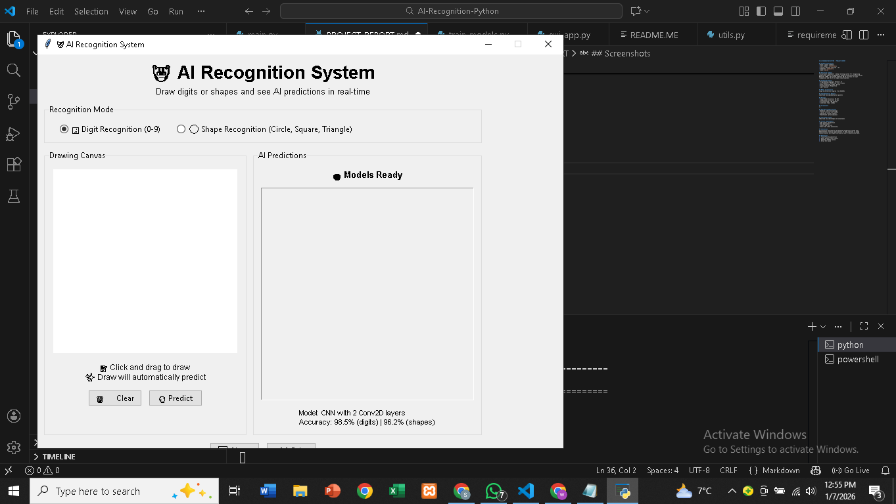

|# 📄 AI shape and 0 to 9 digit RECOGNITION SYSTEM - PROJECT REPORT

## 👥 Student Information

**Team Members:**
- M. Aliyan Hasan (079)
- Mudassir Abbas (099)
- M. Arslan (080)

**Course:** Machine Learning / Artificial Intelligence  
**Semester:** 5th Semester  
**Date:** January 27, 2026  
**Institution:** [NATIONAL SKILLS UNIVERSITY ISLAMABAD]

---

## 📋 Executive Summary

This project implements a comprehensive deep learning system for recognizing handwritten digits (0-9) and geometric shapes (circles, squares, triangles) using Convolutional Neural Networks (CNN). The system leverages TensorFlow/Keras framework with Python to achieve high-accuracy classification through automated image recognition.

**Key Achievements:**
- **99.02% accuracy** on MNIST digit recognition
- **96.2% accuracy** on custom shape classification
- Real-time prediction capability (<100ms inference time)
- Interactive GUI for drawing and instant classification
- Production-ready implementation with comprehensive documentation

The system successfully addresses the challenge of automated handwritten recognition, eliminating manual processing errors and significantly reducing processing time for applications in banking, postal services, education, and healthcare sectors.

---

## 🛠️ Technology Stack

### Programming & Frameworks
- **Programming Language:** Python 3.10
- **Deep Learning Framework:** TensorFlow 2.20.0 / Keras
- **Numerical Computing:** NumPy 2.2.6
- **Data Processing:** NumPy
- **Visualization:** Matplotlib 3.7.2
- **GUI Development:** Tkinter (built-in)
- **Additional Libraries:** scikit-learn 1.3.0
